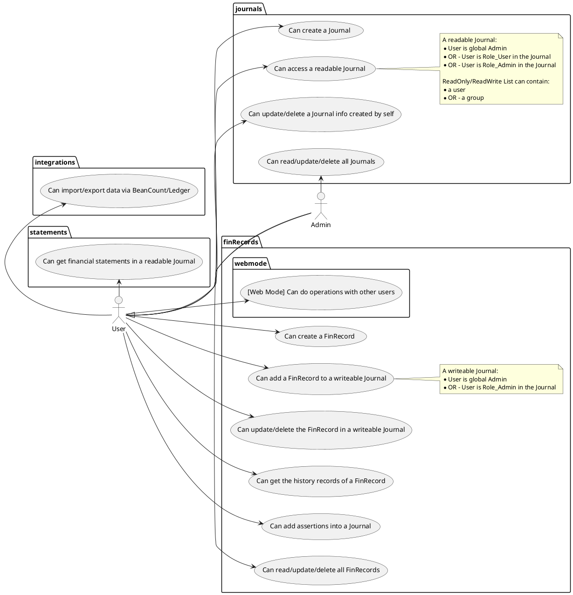

# Requirement Analysis

## Domain Knowledge

### Accounts

The account is the category of financial behaviors. There are **five** first-class accounts:

- Assets
- Liabilities
- Income
- Expenses
- Equity

With important identity:

$$
assets = liabilities + equity + (income - expenses)
$$

The key of accounting is how to make the identity **zero-out**.

#### Accounts: Basic Properties

- `type`: Which of the first-class accounts belonged to
- `name`: A hierarchical structure, representing as a string array
- `unit`: The commodity unit of this account
- `inventoryRecords`: The inventory records of the commodity
- `bookingOperation`: FIFO, AVERAGE

**Inventory Record:**

- `timestamp`: When this commodity checked in/out
- `amount`: The amount of this commodity
- `unitPrice`: Optional, the unit price of this commodity

### FinRecord: Financial Record

**FinRecord** is the smallest item in one financial action.

#### FinRecord: Basic Properties

- `id`: The unique ID for one FinRecord
- `author`: Who add this record
- `isDeleted`: Is this record deleted
- `happenedAt`: When this action happened
- `createdAt`: When this record added
- `name`: The name of this action
- `isContingent`: If you have any questions about this action
- `items`: Record items. At least two members. Should be zero-out
- `tags`: Tags of this record
- `basicUnit`: Basic unit, always be a concurrency type
- `unitMapping`: The mapping relationships between the `basicUnit` and others
  - All the units mentioned in a FinRecord should be mapped here (unless the basicUnit)
- `updateHistories`: The updating histories on this record
- `note`: The note to this record

**FinRecord Item:**

- `account`: The account associated
- `amount`: The amount of this action
- `unit`: The unit of this action, always be a concurrency unit but can be others
- `unitPrice`: Optional, the unit price of this commodity
- `note`: The note to this item

**FinRecord History:**

- `timestamp`: When this update happened
- `author`: Who updated this
- `fields`: A list for which fields updated

**Update Result:**

- `<field-name>`: Object key is the field name, value is: `{ type: "ADDED | UPDATED | REMOVED", data: <primitive data | another update result> }`

## User Cases

